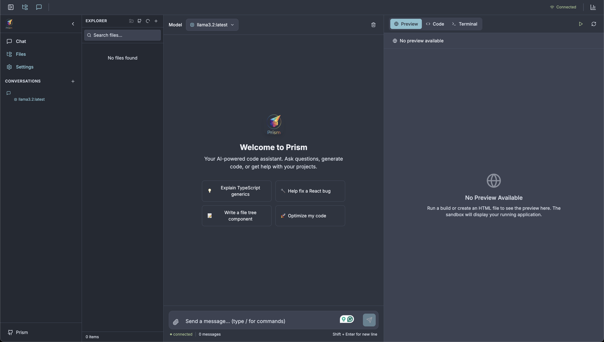

# Prism

**Prism** is a free and open-source, self-hosted web agent. It supports multiple LLM providers, GitHub integration, and secure sandboxed tool execution.



## Features

- **Multi-Provider LLM Support**: OpenAI, Anthropic, Google AI, OpenRouter, Groq, DeepSeek, and Ollama
- **Secure by Design**: AES-256 encrypted API key storage, JWT authentication, sandboxed Docker execution
- **GitHub Integration**: OAuth-based repository access for code operations
- **File Uploads**: Support for images, PDFs, and code files

- **Configurable Tool Approval**: Auto-execute by default, with per-tool approval settings
- **Mobile Responsive**: Access from any device through your hosted instance
- **API Access**: Generate API keys for external client access
- **Modern UI**: ChatGPT/Claude-like chat interface with dark/light themes

## Quick Start

### Prerequisites

- Docker and Docker Compose
- Go 1.20+ (for local development)
- Node.js 20+ (for local development)

### Installation

1. Clone the repository:
   ```bash
   git clone https://github.com/jackulau/Prism.git
   cd prism
   ```

2. Copy the environment file:
   ```bash
   cp .env.example .env
   ```

3. Generate an encryption key:
   ```bash
   openssl rand -hex 32
   ```
   Add this to your `.env` file as `ENCRYPTION_KEY`.

4. Start the application:
   ```bash
   make prod
   ```

5. Open http://localhost:3000 in your browser.

### Development

For local development with hot reload:

```bash
# Install dependencies
make setup

# Start development servers
make dev
```

Or run components separately:

```bash
# Terminal 1: Backend
make run-backend

# Terminal 2: Frontend
make run-frontend
```

## Configuration

### Environment Variables

| Variable | Description | Default |
|----------|-------------|---------|
| `PORT` | Backend server port | `8080` |
| `DATABASE_URL` | SQLite database path | `./data/prism.db` |
| `ENCRYPTION_KEY` | 32-byte hex key for encrypting API keys | (required) |
| `JWT_SECRET` | Secret for JWT tokens | `change-me-in-production` |
| `GITHUB_CLIENT_ID` | GitHub OAuth App client ID | (optional) |
| `GITHUB_CLIENT_SECRET` | GitHub OAuth App client secret | (optional) |
| `OLLAMA_HOST` | Ollama API endpoint | `http://localhost:11434` |

### LLM Providers

Users configure their own API keys through the Settings UI. Prism supports a wide range of providers:

| Provider | Models | Tools | Vision | Best For |
|----------|--------|-------|--------|----------|
| [OpenAI](https://platform.openai.com/api-keys) | GPT-4.1, o3, o4-mini | Yes | Yes | General purpose, reasoning |
| [Anthropic](https://console.anthropic.com/settings/keys) | Claude Opus/Sonnet/Haiku 4.5 | Yes | Yes | Coding, analysis |
| [Google AI](https://aistudio.google.com/app/apikey) | Gemini 2.5 Flash/Pro | Yes | Yes | Large context (1M tokens) |
| [OpenRouter](https://openrouter.ai/keys) | 200+ models | Varies | Varies | Access to all models |
| [Groq](https://console.groq.com/keys) | Llama 3.3, Mixtral | Yes | Some | Ultra-fast inference |
| [DeepSeek](https://platform.deepseek.com/api_keys) | DeepSeek V3, R1, Coder | Yes | No | Cost-effective reasoning |
| [Ollama](https://ollama.ai) | Any local model | Some | Some | Privacy, no API costs |

#### Quick Setup

1. Click the **Settings** icon in the sidebar
2. Select a provider and enter your API key
3. Choose a model from the dropdown

For detailed setup instructions and model recommendations, see [Provider Documentation](docs/providers.md).

### GitHub OAuth Setup

1. Go to GitHub Settings > Developer Settings > OAuth Apps
2. Create a new OAuth App
3. Set the callback URL to `http://your-domain/api/v1/github/callback`
4. Add the Client ID and Secret to your `.env` file

## Architecture

```
prism/
├── backend/           # Go backend (Fiber)
│   ├── cmd/server/    # Entry point
│   └── internal/
│       ├── api/       # HTTP handlers & WebSocket
│       ├── llm/       # LLM provider implementations
│       ├── tools/     # Tool execution & sandbox
│       ├── github/    # GitHub integration
│       └── security/  # Crypto, JWT, auth
├── frontend/          # React + TypeScript
│   └── src/
│       ├── components/  # UI components
│       ├── hooks/       # React hooks
│       ├── services/    # API & WebSocket clients
│       └── store/       # Zustand state
└── sandbox/           # Docker sandbox images
```

## Security

- **API Keys**: Encrypted at rest with AES-256-GCM
- **Passwords**: Hashed with Argon2id
- **Sessions**: JWT with 15-minute access tokens
- **Tool Execution**: Isolated Docker containers with:
  - Memory limits (512MB default)
  - CPU limits (0.5 cores default)
  - Timeout (60 seconds default)
  - Network isolation
  - Read-only root filesystem

## API

### WebSocket

Connect to `/api/v1/ws?token=<access_token>` for real-time chat streaming.

### REST Endpoints

- `POST /api/v1/auth/register` - Register
- `POST /api/v1/auth/login` - Login
- `GET /api/v1/conversations` - List conversations
- `POST /api/v1/chat/completions` - Send chat message (non-streaming)

## Contributing

Contributions are welcome! Please read our [Contributing Guide](CONTRIBUTING.md) first.

## License

Apache License 2.0 - see [LICENSE](LICENSE) for details.

## Support

- [GitHub Issues](https://github.com/jackulau/Prism/issues)
- [Discussions](https://github.com/jackulau/Prism/discussions)
